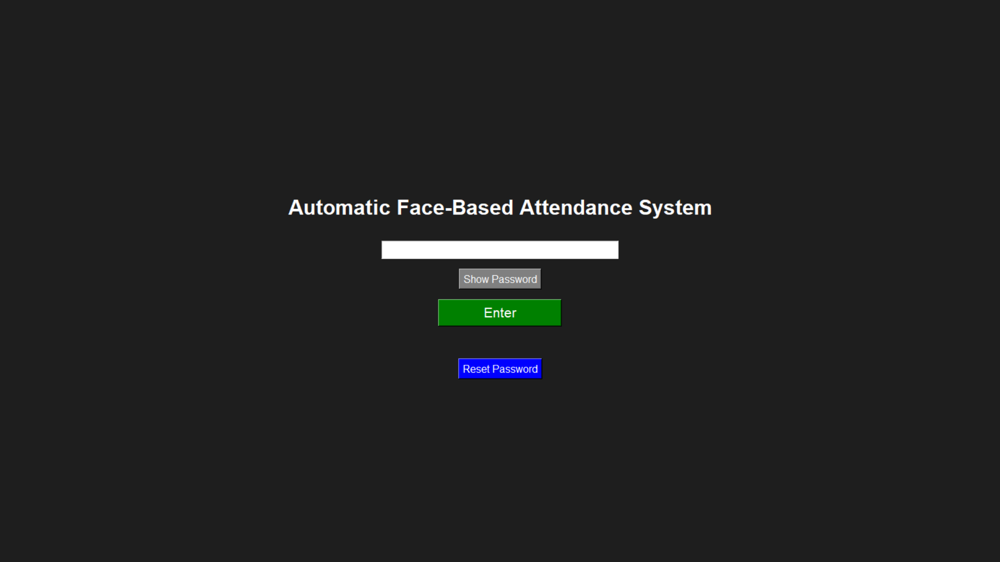
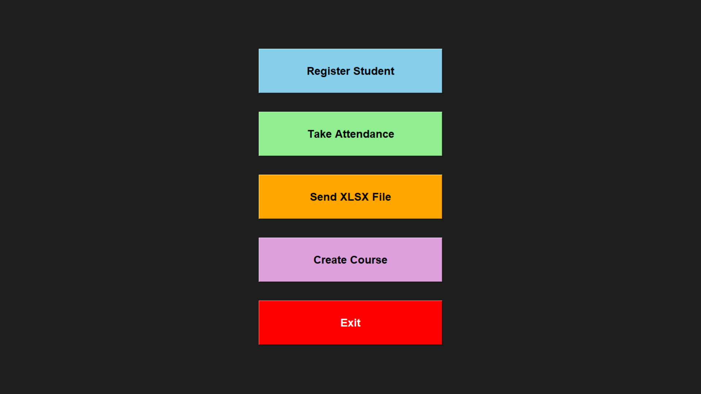
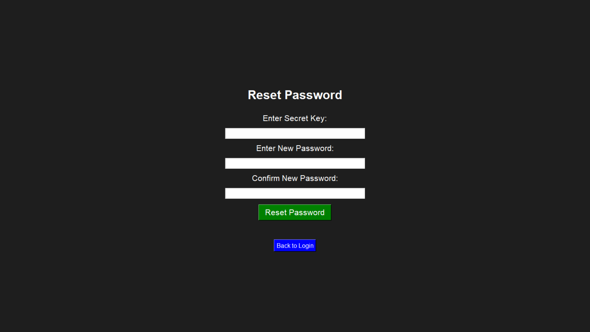
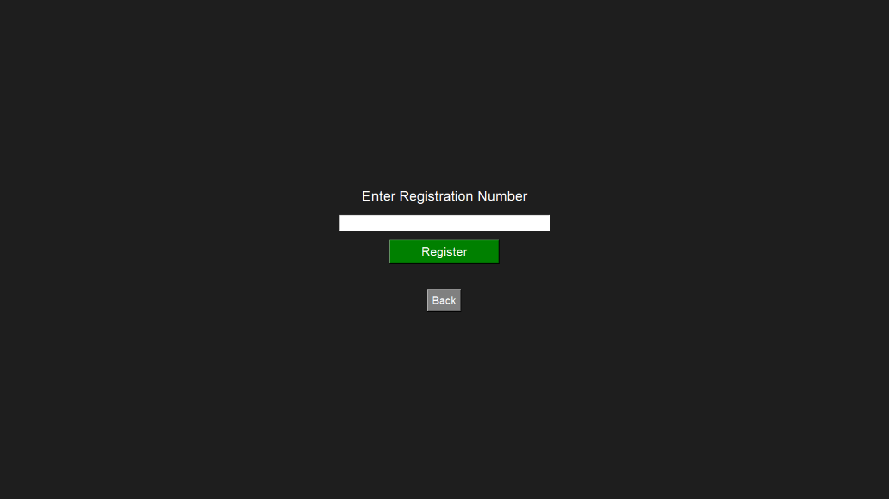
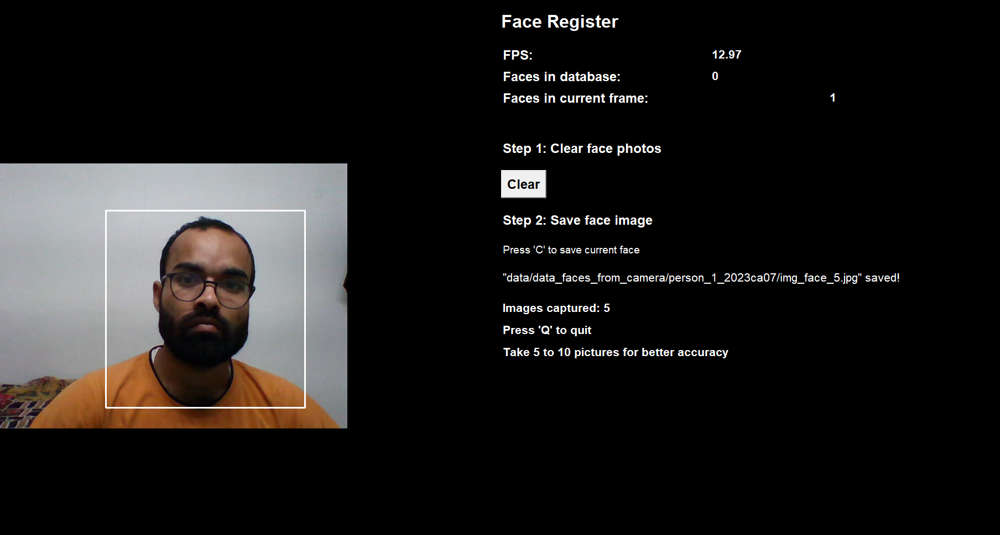
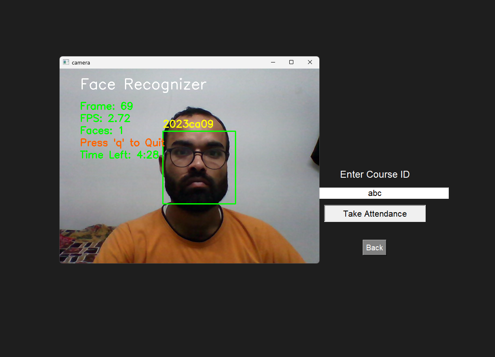
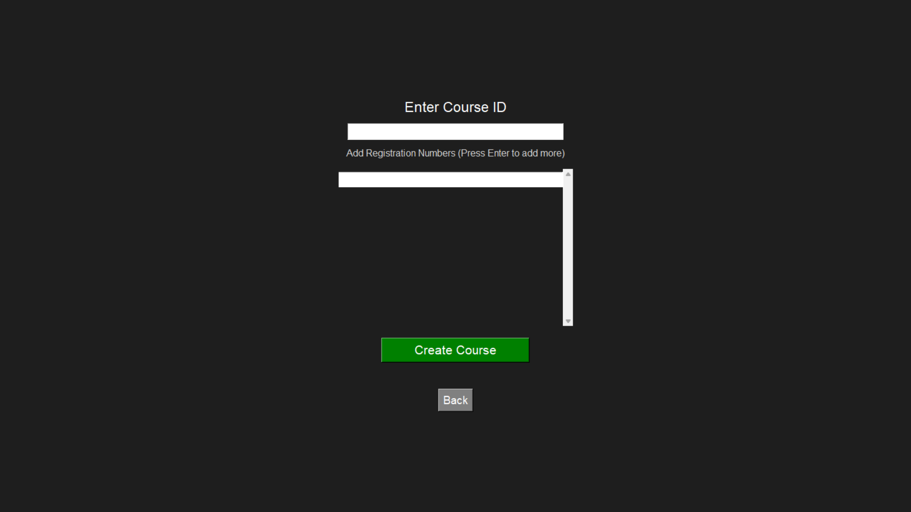
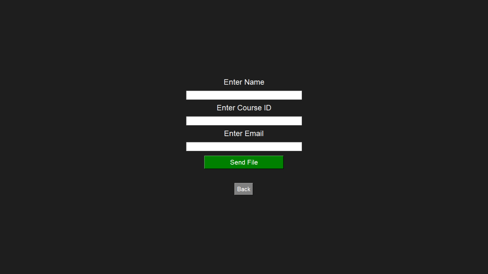
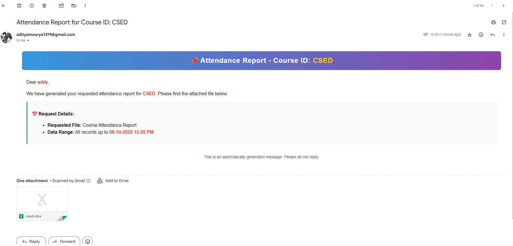

<h1 align="center">Automatic Face Attendance System</h1>

<p align="center">
  A compact, offline, face recognition-based attendance system built with Python, OpenCV, dlib, and Tkinter. 
  Designed to automate and simplify attendance management in classrooms, especially for offline or low-connectivity environments.
</p>

<p align="center">
  
  
  
  
</p>

---

## 📑 Table of Contents

- [Features](#features)
- [Project Structure](#project-structure)
- [Installation](#installation)
- [Usage](#usage)
- [Screenshots](#screenshots)
- [Environment Variables (.env)](#environment-variables-env)
- [Unique Highlights](#unique-highlights)
- [Contributing](#contributing)
- [License](#license)

---

## 🚀 Features

- **Raspberry Pi Compatible:** Lightweight, portable, and cost-effective. Works perfectly on Raspberry Pi 4 Model B.
- **Face Recognition using dlib (128D Facial Features):** High accuracy, privacy-focused (no cloud storage).
- **Automatic Attendance Marking:** Attendance saved in `.xls` files course-wise with timestamps.
- **Student Registration UI:** Capture multiple face angles and store them locally.
- **Course-Wise Attendance Management:** Create and manage separate XLS files for each course.
- **Email Attendance Files:** Supports manual sending of attendance reports via built-in email integration.
- **Voice Announcements:** Announces registration numbers of present students for manual verification.
- **Auto-Deletion of Images:** Enhances privacy by deleting images after feature extraction.
- **Basic GUI:** Tkinter-based, suitable for non-technical users.
- **Offline First:** Fully operational without internet (except for email sending).

---

## Project Structure

```
automatic_attendance_system/
│
├── main.py
├── attendance_taker.py
├── features_extraction_to_csv.py
├── get_faces_from_camera_tkinter.py
├── mailing_xls_attendance_file.py
│
├── xls_attendance/
│   ├── marking_attendance_in_xls.py
│   ├── voice_call_of_name.py
│   └── xls_file_creator.py
│
├── attendance_record/
│   ├── cs102.xlsx
│   ├── cs201.xlsx
│
├── data/
│   ├── data_dlib/
│   │   ├── dlib_face_recognition_resnet_model_v1.dat
│   │   └── shape_predictor_68_face_landmarks.dat
│   ├── data_faces_from_camera/
│   └── features_all.csv
│
├── .env
├── .env.sample
├── requirements.txt
├── attendance.db
├── .gitignore
└── .gitattributes
```

## Installation

1. Clone the repository

   ```bash
   git clone https://github.com/Surya1CAadi/AutoAttend.git
   cd AutoAttend
   ```

2. Install the dependencies

   ```bash
   pip install -r requirements.txt
   ```

3. Set up environment variables
   - Copy `.env.sample` to `.env`
   - Fill in your email credentials and basic configurations.

## Usage

1. Run the Main Application

   ```bash
   python main.py
   ```

2. Functionalities Available:
   - Register Student: Capture and save multiple face angles.
   - Take Attendance: Detect faces and mark present students in course-wise XLS.
   - Send Attendance Report: Email attendance file to the specified address.
   - Create Course: Add new courses for attendance tracking.

---

🖼️ Screenshots

<p align="center">
🏠 Home Page
<br>
<br>
</p>
<p align="center">
📋 Main Page
<br>
<br>
</p>
<p align="center">
🔐 Reset Password
<br>
<br>
</p>
<p align="center">
🧑‍🎓 Register Student
<br>
 <br><br>
</p>
<p align="center">
✅ Attendance Taking
<br>
<br>
</p>
<p align="center">
🧾 Creating Course
<br>
<br>
</p>
<p align="center">
📧 Sending Mail
<br>
<br>
</p>
<p align="center">
📧 Sample Mail
<br>
<br>
</p>

---

🔐 Environment Variables (.env)

| Variable       | Description                        |
| -------------- | ---------------------------------- |
| EMAIL_SENDER   | Your Gmail/SMTP email address      |
| EMAIL_PASSWORD | App-specific password for Gmail    |
| SMTP_SERVER    | SMTP server (e.g., smtp.gmail.com) |
| SMTP_PORT      | SMTP port (e.g., 587)              |

## Unique Highlights

| Feature                         | Our System | Biometric Devices | RFID   | Cloud Face Apps |
| ------------------------------- | ---------- | ----------------- | ------ | --------------- |
| Touchless Face-Based Attendance | ✅         | ❌                | ✅     | ✅              |
| Offline Full Functionality      | ✅         | ✅                | ✅     | ❌              |
| Course-wise XLS Generation      | ✅         | ❌                | ❌     | Some            |
| Voice Announcement              | ✅         | ❌                | ❌     | ❌              |
| Secure Local Storage            | ✅         | ✅                | ✅     | ❌              |
| Auto-Deletion of Student Images | ✅         | N/A               | N/A    | ❌              |
| Proxy Prevention (Anti-fraud)   | ✅         | ✅                | N/A    | N/A             |

## Contributing

Contributions, ideas, and feedback are welcome.  
Feel free to open an Issue or submit a Pull Request.

## License

This project is licensed under the MIT License.

---

<p align="center"> Made with ❤️ using Python, OpenCV, and dlib </p>
